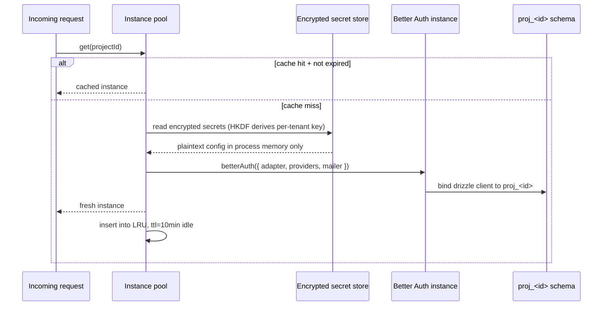

# ARCHITECTURE.md — briven multi-service architecture

**Status:** living document · authoritative for cross-service infrastructure
**Audience:** anyone adding a new briven service (briven auth = service #2, briven pay = service #3)
**Companion:** `BUILD_PLAN.md` (briven auth spec) · `docs/BUILD_PLAN.md` (platform spec)

This document captures the decisions that make briven a **platform** rather than a stack of one-off services. Every service after the database (briven auth, then briven pay) reuses the machinery described here. The forward-compat hooks for briven pay are explicit at the end.

---

## 1. The three-layer pattern (every briven service follows it)

```
┌───────────────────────────────────────────────────────────────────────┐
│  Layer 3 — Surface                                                    │
│  developer dashboard tab · SDK · hosted pages · email templates · docs│
└──────────────────────────────┬────────────────────────────────────────┘
                               │
┌──────────────────────────────┴────────────────────────────────────────┐
│  Layer 2 — Multi-tenant layer (REUSED ACROSS SERVICES)                │
│  • tenant routing (projectId resolution)                              │
│  • per-tenant instance pool + cache                                   │
│  • encrypted secret store (HKDF per tenant)                           │
│  • per-tenant rate limiting                                           │
│  • outbound webhook fanout (HMAC-signed)                              │
│  • billing meter abstraction (Polar ↔ mavi-pay swap)                  │
└──────────────────────────────┬────────────────────────────────────────┘
                               │
┌──────────────────────────────┴────────────────────────────────────────┐
│  Layer 1 — Engine                                                     │
│  briven database: native (apps/api + apps/runtime + apps/realtime)    │
│  briven auth:     Better Auth (consumed as npm dep, never forked)     │
│  briven pay:      mavi-pay (planned)                                  │
└───────────────────────────────────────────────────────────────────────┘
```

Every service plugs a different Layer 1 engine into the same Layer 2 machinery. Layer 3 is service-specific UI/SDK. **Whenever a new service is added, Layer 2 must not change — if it has to, the change is a Layer 2 contract change and applies to every service.**

---

## 2. Tenant identity is `projectId` everywhere

A briven customer can have many projects. Every authenticated entity in the platform — a database, an auth tenant, a payments tenant — is keyed by `projectId` (ULID, prefix `p_`). This is non-negotiable.

Implications:

- API routes scoped to a tenant carry `:id` as the project id in the URL path (`/v1/projects/:id/auth/users`).
- SDK clients init with `projectId` + a public key. Never with an opaque per-service "tenant id".
- Per-service tables on the customer's data-plane schema live under `proj_<projectId>` already, so the auth tables (`_briven_auth_users`, etc) and the payment tables (future) co-locate with the customer's own data.
- Webhook signing keys, encrypted secrets, rate-limit buckets, redis cache keys — every per-tenant state is keyed by `projectId`.
- Cross-tenant code paths are forbidden. If a feature needs aggregation across projects (platform analytics), it queries the meta-DB only, never customer schemas.

---

## 3. Per-tenant Better Auth instance pool (briven auth, reused shape for briven pay)

### Lifecycle



### Eviction policy

- **Idle eviction:** 10 minutes since last request to that tenant's instance. LRU cache size capped at 256 instances per api process; older entries evicted on insert pressure.
- **Force eviction:** explicit on config change (provider toggled, secret rotated, branding updated) — the dashboard's PATCH calls invalidate the cache entry for that project id.
- **Process restart:** all instances dropped. First request after restart for a tenant cold-creates a new one (~50–150ms one-time cost). Acceptable at year-one scale.

### Cache key

`projectId` only. Never an indirect derivation — direct map lookup.

### Memory bound

Each Better Auth instance holds: provider config, drizzle client (one pg pool connection per project tenant in v1, shared per-project across instances), mailer config, encryption keys (in-process, never serialised). Rough budget: ≤ 200 KB / instance. 256 instances × 200 KB = ~50 MB per api process. Acceptable.

### Engine swap (briven pay reuse)

The same pool shape works for briven pay. `getMaviPayInstance(projectId)` mirrors `getBrivenAuthInstance(projectId)`. The pool implementation lives in `apps/api/src/services/tenant-instance-pool.ts` as a generic `TenantInstancePool<TEngine>` so each service registers a factory function.

---

## 4. Encrypted secret store (REUSED across briven auth + briven pay)

### Key derivation

```
master_key       = BRIVEN_AUTH_MASTER_KEY     (briven auth; 32 random bytes)
                 = BRIVEN_PAY_MASTER_KEY      (briven pay; rotated independently)
tenant_key       = HKDF(master_key, salt=projectId, info='briven-auth-v1' | 'briven-pay-v1')
ciphertext       = AES-256-GCM(plaintext, tenant_key, random_nonce)
stored_blob      = nonce || tag || ciphertext           // 12 || 16 || N bytes
```

### Properties

- **Forward isolation:** leak of one tenant's plaintext does not let an attacker decrypt another tenant's ciphertext (different HKDF outputs).
- **Forward compromise:** rotating the master key requires re-deriving every tenant key + re-encrypting every secret. Rotation procedure documented in `docs/runbooks/auth-master-key-rotation.md` (to be authored during step 11).
- **Service isolation:** the `info=` parameter to HKDF differs per service. A briven auth secret encrypted with the briven auth master key cannot be decrypted with the briven pay master key, even if both share a project id.
- **In-process only:** plaintext exists in memory during a single request handler. Never logged, never written to disk, never returned via any API except in the test-connection panel where the customer is decrypting their own secret to verify a paste.

### Storage location

Encrypted blobs live in the control plane's meta-DB, table `tenant_secrets`:

```sql
CREATE TABLE tenant_secrets (
  id           text PRIMARY KEY,                  -- ULID
  project_id   text NOT NULL,                     -- tenant
  service      text NOT NULL,                     -- 'auth' | 'pay'
  slot         text NOT NULL,                     -- 'google_oauth_client_secret' | 'stripe_webhook_secret' | ...
  ciphertext   bytea NOT NULL,                    -- nonce || tag || encrypted bytes
  created_at   timestamptz NOT NULL DEFAULT now(),
  rotated_at   timestamptz,
  UNIQUE (project_id, service, slot)
);
```

A leaked database dump exposes only ciphertext; without the master key the plaintext is unrecoverable.

---

## 5. Webhook fanout (REUSED)

Every briven service that emits events shares one fanout. `briven_webhook_endpoints` lives in the control plane:

```sql
CREATE TABLE briven_webhook_endpoints (
  id             text PRIMARY KEY,
  project_id     text NOT NULL,
  service        text NOT NULL,                   -- 'auth' | 'pay'
  url            text NOT NULL,
  signing_secret bytea NOT NULL,                  -- encrypted (same scheme as §4)
  events         text[] NOT NULL,                 -- ['signup','signin','session.revoked',...]
  created_at     timestamptz NOT NULL DEFAULT now(),
  disabled_at    timestamptz
);
```

Outbound event:

```
POST <url>
X-Briven-Service: auth
X-Briven-Event: signup
X-Briven-Timestamp: <unix>
X-Briven-Signature: hmac-sha256(signing_secret, timestamp || '.' || body)
content-type: application/json

{ "id": "evt_...", "type": "signup", "createdAt": "...", "data": { ... } }
```

Customer verification snippet provided in docs per service. **Same signature shape across services** — a customer who already verified briven-auth webhooks reuses the verification code for briven-pay webhooks.

Retries: 24h exponential backoff (1m, 5m, 15m, 1h, 6h, 24h). Dead-letter after 6 failures. Worker is `apps/api/src/workers/outbound-webhook-dispatcher.ts` (already exists for the database service; extended in step 8 of the auth build).

---

## 6. Rate limiting (REUSED via the existing middleware)

`apps/api/src/middleware/rate-limit.ts` already exposes:

- `rateLimit(options)` — base middleware
- `projectRateLimit(scope)` — tier-aware, keyed by `:id`
- `userRateLimit(scope, cap)` — keyed by session user

briven auth uses `projectRateLimit` for project-scoped admin routes and `userRateLimit` for session-scoped end-user routes. **Per-tenant rate limit ceilings are pulled from the same tier table (`RATE_LIMITS_BY_TIER` in `apps/api/src/services/tiers.ts`)** — extended with new scopes `auth_admin`, `auth_signin`, `auth_signup`, etc.

No new rate-limit infrastructure is built for briven auth. The plan adds new scope constants and new tier-row entries, not new middleware.

---

## 7. Billing meter abstraction (Polar.sh today, mavi-pay swap-in tomorrow)

### Provider interface

```ts
// apps/api/src/services/billing/provider.ts
export interface BillingProvider {
  reportUsage(args: {
    projectId: string;
    meterId: string;
    quantity: number;
    occurredAt: Date;
  }): Promise<void>;

  createCheckout(args: {
    projectId: string;
    tier: 'free' | 'pro' | 'team';
    successURL: string;
  }): Promise<{ checkoutURL: string }>;

  createPortalSession(args: { customerId: string; returnURL: string }): Promise<{ url: string }>;
}
```

### Factory

```ts
// apps/api/src/services/billing/index.ts
function getBillingProvider(): BillingProvider {
  switch (env.BRIVEN_BILLING_PROVIDER) {
    case 'polar': return polarProvider;
    case 'mavi-pay': return maviPayProvider;          // future
    default: throw new Error('BRIVEN_BILLING_PROVIDER not configured');
  }
}
```

### Call sites

Every billing call site already in the codebase (`apps/api/src/services/billing.ts`, `workers/polar-meter-push.ts`, etc) is migrated to call `getBillingProvider()` instead of importing the Polar client directly. This refactor is part of briven auth step 9 (billing integration) since briven auth introduces the first new meter (`briven_auth_mau`). After the refactor, switching to mavi-pay is one env var + a new provider implementation; zero call-site changes.

---

## 8. The forward-compat contract for briven pay (REUSE POINTS)

When briven pay is built, it **must** reuse the following, exactly as drafted for briven auth — every reuse point with the file it lives in:

| Reuse point | File / module | Briven pay's use |
| --- | --- | --- |
| `TenantInstancePool<TEngine>` | `apps/api/src/services/tenant-instance-pool.ts` | one mavi-pay instance per project |
| `tenant_secrets` table + HKDF encryption | `apps/api/src/db/schema.ts` + `apps/api/src/services/tenant-secret-store.ts` | Stripe/Adyen/mavi-pay API keys, webhook secrets |
| `briven_webhook_endpoints` table + dispatcher | `apps/api/src/workers/outbound-webhook-dispatcher.ts` | `payment.succeeded`, `subscription.created`, etc |
| `projectRateLimit` middleware | `apps/api/src/middleware/rate-limit.ts` | identical usage; new scopes added to `RATE_LIMITS_BY_TIER` |
| Billing provider interface | `apps/api/src/services/billing/provider.ts` | swap-in target — briven pay becomes a `BillingProvider` implementation that satisfies the same interface |
| Dashboard service-tab pattern | `apps/web/src/app/(dashboard)/dashboard/projects/[id]/auth/` (briven auth) | new sibling at `…/payments/` follows the same five-sub-route layout |
| SDK init pattern | `packages/auth/src/index.ts:createBrivenAuth({ projectId, publicKey })` | `packages/pay/src/index.ts:createBrivenPay({ projectId, publicKey })` mirrors signature |
| Webhook event signature shape | header schema above + HMAC-sha256 | identical |
| mittera email pipeline | `apps/api/src/lib/email.ts` | receipts, dispute notifications |
| Tenant-isolation pen-test harness | `tests/security/tenant-isolation.test.ts` (built in auth step 11) | extended with new endpoints, same harness |

### What briven pay CANNOT change

- The `projectId` identity scheme. If briven pay introduces a new tenant identifier, it forks the platform.
- The HKDF key derivation function. Tenants would need re-encryption.
- The webhook header schema. Customers already verifying briven auth webhooks would need to rewrite their verification code.
- The dashboard URL scheme `/dashboard/projects/:id/<service>/`. Bookmarks + integrations would break.

### What briven pay CAN add

- New scope strings in `RATE_LIMITS_BY_TIER`.
- New `service` value in `tenant_secrets.service` (`'pay'`).
- New `service` value in `briven_webhook_endpoints.service`.
- New event types over the existing webhook header schema.
- New `BillingProvider` implementation under `apps/api/src/services/billing/providers/mavi-pay.ts`.
- New dashboard tab + new SDK package at `packages/pay/`.

If a briven pay decision requires changing anything in the "cannot change" list, it is **architecturally rejected** and must be re-scoped.

---

## 9. Service boot order

API process starts every service in this order:

1. Load env.
2. Connect to control-plane postgres + redis.
3. Initialise the briven database service (existing `apps/api/src/index.ts` boot path).
4. Mount the briven auth router (`apps/api/src/routes/auth-service.ts`) **only if** `BRIVEN_AUTH_ENABLED=true`. The router lazily creates instance-pool entries on demand; no cold work at boot.
5. (Future) mount briven pay router only if `BRIVEN_PAY_ENABLED=true`.

Each service has a kill-switch env so it can be disabled in an emergency without redeploying. Default is **enabled**.

---

## 10. Observability conventions

Every service emits metrics under its own prefix:

- `briven_db_*` — database service (existing)
- `briven_auth_*` — auth service (new in this build)
- `briven_pay_*` — pay service (future)

Logs carry a `service: 'auth' | 'pay' | 'db'` field via `@briven/shared/observability`. Promtail's file-based discovery in `infra/observability/promtail/config.yaml` already routes these correctly — no change needed.

Per-service `/health` and `/ready` endpoints are mounted under the service router (`/v1/auth/health`, `/v1/auth/ready`) in addition to the api-wide endpoints.

---

## 11. Open architectural questions (none — closed 2026-05-19)

The eight original open questions from `BUILD_PLAN.md` §17 are all resolved (see the "Decisions locked" table at the top of that document). No architectural blockers remain for starting briven auth implementation.

When briven pay enters planning, a sibling `BUILD_PLAN_PAY.md` opens its own §17 list of open questions. Until then, this document is the contract.

---

## 12. Glossary

| Term | Meaning |
| --- | --- |
| tenant | one briven project — identified by `projectId` (`p_<ulid>`) |
| service | one of: briven database, briven auth, briven pay |
| layer 1 / engine | the third-party or first-party machinery doing the work (postgres, Better Auth, mavi-pay) |
| layer 2 / multi-tenant layer | briven-native routing + isolation + secret + billing infrastructure that wraps every engine |
| layer 3 / surface | dashboard + SDK + hosted pages + docs — what the customer sees |
| HKDF | RFC 5869 hash-based key derivation function (`crypto.hkdfSync` in node) |
| instance pool | per-tenant cache of engine instances inside the api process |
| webhook fanout | outbound event delivery with HMAC-sha256 signing + exponential backoff retries |
| tenant_secrets | meta-DB table holding per-tenant encrypted blobs (OAuth secrets, webhook signing keys, etc) |

---

*This document is owned by `j`. Any architectural change must be reflected here in the same PR as the code change, or the PR is incomplete.*
