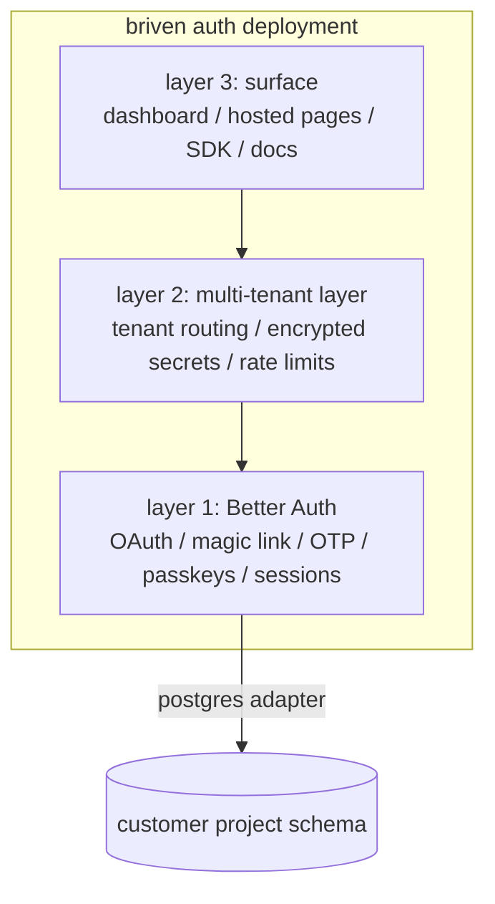

# BUILD_PLAN.md — briven auth (service)

**Status:** planning only · §17 open questions resolved · awaiting human approval to start implementation
**Scope:** briven auth as a single coherent v1 release
**Companion docs:** `docs/BUILD_PLAN.md` (platform spec — database service is service #1; briven auth is service #2)
**Engine:** Better Auth, consumed as an npm dependency, never forked

---

## Decisions locked (2026-05-19) — override any conflicting detail downstream

These are the operator's answers to the eight open questions originally in §17. Wherever the body text below disagrees, this table wins.

| # | Question | Locked answer |
| --- | --- | --- |
| 1 | postgres adapter | **Drizzle**. No spike needed; remove the half-day spike from §13 step 1. |
| 2 | email provider | **mittera** confirmed (replaces Resend everywhere). |
| 3 | DNS for `auth.briven.tech` | **Hostinger** (not Cloudflare). Adjust the DNS/zone-management steps to Hostinger DNS records; traefik routing in `infra/dokploy/` stays as drafted. |
| 4 | naming | service is **"briven Auth"** (customer-facing). Control-plane Better Auth stays as `apps/api/src/routes/auth.ts`; the new customer-facing routes live under `apps/api/src/routes/auth-service.ts`. |
| 5 | MAU plan ceilings | **team = 250K** confirmed. free + pro placeholders (1k / 25k) stay until billing tests; revisit if MAU pricing math changes. |
| 6 | dogfood target | **djstudio** is the v1 dogfood migration target. Once briven auth is in production it is also open to random external customers (not gated to portfolio projects). Update §16 + the marketing copy accordingly. |
| 7 | custom-domain CNAME (`login.customerapp.com`) | **in scope for v1**. Per-tenant TLS via Let's Encrypt + traefik orchestration is part of the build. |
| 8 | Apple Sign-In | **out of scope for v1** — Apple developer account setup is too costly for the project. Drop Apple from the provider list everywhere: §3 schema comment, §4 OAuth start/callback table, §5 SDK `OAuthProvider` type, §6 Providers panel, §11 docs provider guides, §14 acceptance criteria. Provider list becomes: Google, GitHub, Discord, Microsoft (four OAuth providers + magic link + OTP + passkey). |

Effort impact of these decisions: §13 step 1 shrinks from 2 d → ~1 d (no adapter spike, just architecture write-up). Step 7 (SDK) loses Apple provider work. Step 11 (security) loses the Apple cert-rotation runbook from the risk register. Total estimate trims from ~50 d → **~48 d**.

§17 retained below as a record of what was asked + when it was answered; do not treat it as still open.

---

## 0. Stack adaptation note (read before anything else)

The original product spec for briven auth was authored against a Convex stack. briven is **not** Convex — briven is the postgres-native, schema-per-tenant Convex alternative. This plan ports the spec to the locked briven stack:

| Spec original | briven adaptation |
| --- | --- |
| Convex deployment per customer | Postgres schema per project (`proj_<projectId>` in the data-plane cluster) |
| Convex adapter for Better Auth | `better-auth-pg-adapter` (or hand-rolled Drizzle-based adapter) writing into the per-project schema |
| Resend for email | mittera (`mittera.eu`) — briven's own transactional email service |
| `_briven_meta` / schema-per-tenant | unchanged; auth tables join the existing `_briven_*` prefix convention |

The differentiator is preserved: authenticated users land as **queryable native rows in the customer's own briven postgres schema**, joinable against the customer's `posts`, `orders`, or any other table they own. No sync, no shadow table.

Every "Convex" reference in the original prompt maps to "the customer's briven schema in the data-plane cluster" below.

---

## 1. Positioning

briven auth is the second service on the briven platform. It plugs into any briven project that already exists; customers enable it from the project's Auth tab and gain a complete authentication system — OAuth, magic links, email OTP, passkeys, sessions, user management — wired into their app via `@briven/auth` and pre-built React components in under five minutes.

### The single differentiator

Users land as rows in `users`, `sessions`, `accounts`, `verification_tokens`, and `auth_audit_log` **inside the customer's own briven schema**. Joining `users.id` against the customer's `posts.author_id` just works — same connection, same migrations ledger, same query console.

This is the property that distinguishes briven auth from Auth0, Clerk, Logto, and Supabase Auth — none of those put the user table in the customer's primary database. Any architectural decision that breaks this is rejected outright.

### Relationship to existing briven authentication

briven's **control plane** already uses Better Auth for its own admin/customer login (the briven.tech dashboard, the CLI deploy auth, etc.). briven auth (this service) takes the same engine — Better Auth — and makes it available to briven customers for **their** end-users, scoped per project, against the customer's own postgres schema. The two installations are independent: control-plane Better Auth writes to `briven_control`; customer-tenant Better Auth instances write to each project's `proj_<projectId>` schema.

---

## 2. Architecture — three layers

### Layer 1: auth engine — Better Auth (vendored, never forked)

Handles all primitives: password hashing, OAuth handshakes, magic-link token issuance + verification, OTP generation + verification, session JWTs, CSRF, email verification, passkey/WebAuthn. Configured with a postgres adapter so all writes go directly into the customer's project schema.

Adapter choice: prefer `@better-auth/adapter-drizzle` driving a per-project Drizzle client bound to `proj_<projectId>`. Fallback: hand-rolled adapter against the existing `postgres()` client in the api app. Spike both for half a day each, pick the one that keeps Better Auth's typing intact.

### Layer 2: multi-tenant layer (our code)

For every briven project with auth enabled, instantiate a configured Better Auth instance pointing at that project's schema, with the customer's chosen providers and secrets. Route every inbound request to the correct instance by tenant identifier (subdomain segment on `auth.briven.tech` or the `x-briven-project-id` header on SDK calls). Encrypt every OAuth client secret + email credential at rest with AES-256-GCM keyed by tenant id × master key. Per-tenant rate limit on every endpoint.

Tenant isolation is **security-critical**. A cross-tenant data read ends the product. Tenant isolation tests are part of acceptance, not a follow-up.

### Layer 3: briven surface (the bulk of the work)

Developer dashboard tab inside the briven project dashboard. SDK (`@briven/auth`). Pre-built React components. Hosted login pages at `auth.briven.tech/<tenant>/<flow>`. Email pipeline via mittera. Audit log viewer. Webhooks. Billing meter. Docs.

Better Auth itself is invisible to the customer. briven is what they see.

### Engine decision (locked)

Logto, Zitadel, SuperTokens, and similar IdPs ship their own postgres database. Users would live in that storage, separate from the customer's briven schema, requiring sync. That breaks the differentiator. Better Auth + a postgres adapter against the customer's project schema is the only configuration where the differentiator works as advertised. Decision locked.

### Mermaid — request flow

```mermaid
flowchart LR
  app[customer app] -->|sign in| sdk[@briven/auth SDK]
  sdk -->|POST /v1/auth/...| edge[auth.briven.tech edge]
  edge -->|tenant resolve| router[tenant router]
  router -->|projectId| instance[Better Auth instance pool]
  instance -->|postgres adapter| pgschema[(proj_xxx schema<br/>users / sessions / accounts<br/>verification_tokens / auth_audit_log)]
  instance -->|email| mittera[mittera]
  instance -->|signin event| webhook[webhook fanout]
  webhook -->|HTTP POST| customer_hook[customer webhook endpoint]
```

### Mermaid — three-layer view



---

## 3. Database schema (auto-provisioned in the customer's project schema)

Every table prefixed with the existing `_briven_auth_` convention so customer code cannot shadow them and they survive customer-driven schema migrations untouched. Provisioned via the existing `apps/api/src/services/schema-apply.ts` path the first time a project enables auth.

### Tables

```sql
CREATE TABLE "_briven_auth_users" (
  id              text PRIMARY KEY,                 -- ULID
  email           citext UNIQUE NOT NULL,           -- citext for case-insensitive match
  email_verified  timestamptz,                      -- null = unverified
  name            text,
  image           text,                             -- URL
  created_at      timestamptz NOT NULL DEFAULT now(),
  updated_at      timestamptz NOT NULL DEFAULT now()
);

CREATE TABLE "_briven_auth_sessions" (
  id                text PRIMARY KEY,
  user_id           text NOT NULL REFERENCES "_briven_auth_users"(id) ON DELETE CASCADE,
  token             text UNIQUE NOT NULL,           -- opaque, 32 bytes random
  expires_at        timestamptz NOT NULL,
  ip_address_hash   bytea,                          -- sha-256 of canonicalised ip, NEVER raw
  user_agent        text,                           -- bounded length, truncated at 512
  created_at        timestamptz NOT NULL DEFAULT now()
);
CREATE INDEX ON "_briven_auth_sessions" (user_id);
CREATE INDEX ON "_briven_auth_sessions" (expires_at);

CREATE TABLE "_briven_auth_accounts" (
  id                          text PRIMARY KEY,
  user_id                     text NOT NULL REFERENCES "_briven_auth_users"(id) ON DELETE CASCADE,
  provider_id                 text NOT NULL,        -- 'google' / 'github' / 'discord' / 'apple' / 'microsoft' / 'passkey' / 'email'
  provider_account_id         text NOT NULL,        -- the upstream id
  refresh_token_encrypted     bytea,                -- AES-256-GCM, key from tenant master
  access_token_encrypted      bytea,
  scope                       text,
  created_at                  timestamptz NOT NULL DEFAULT now(),
  updated_at                  timestamptz NOT NULL DEFAULT now(),
  UNIQUE (provider_id, provider_account_id)
);
CREATE INDEX ON "_briven_auth_accounts" (user_id);

CREATE TABLE "_briven_auth_verification_tokens" (
  id          text PRIMARY KEY,
  identifier  text NOT NULL,                        -- email for magic-link/OTP
  value_hash  bytea NOT NULL,                       -- sha-256 of the token; raw token never persisted
  type        text NOT NULL CHECK (type IN ('magic_link', 'otp', 'password_reset', 'email_verify')),
  expires_at  timestamptz NOT NULL,
  consumed_at timestamptz,                          -- one-shot; null until consumed
  created_at  timestamptz NOT NULL DEFAULT now()
);
CREATE INDEX ON "_briven_auth_verification_tokens" (identifier, type);
CREATE INDEX ON "_briven_auth_verification_tokens" (expires_at);

CREATE TABLE "_briven_auth_audit_log" (
  id              text PRIMARY KEY,
  user_id         text REFERENCES "_briven_auth_users"(id) ON DELETE SET NULL,
  action          text NOT NULL,                    -- 'signup' / 'signin' / 'signout' / 'session.revoked' / 'account.linked' / 'account.unlinked' / 'password.reset' / 'admin.*'
  ip_address_hash bytea,
  user_agent      text,
  metadata        jsonb NOT NULL DEFAULT '{}',
  occurred_at     timestamptz NOT NULL DEFAULT now()
);
CREATE INDEX ON "_briven_auth_audit_log" (user_id, occurred_at DESC);
CREATE INDEX ON "_briven_auth_audit_log" (action, occurred_at DESC);
```

### Auto-provisioning

When a customer clicks **Enable Auth**:

1. Mark `_briven_meta.auth_enabled = true` in the project's existing meta table.
2. Run a single transactional migration that creates the five tables above + their indexes + the `citext` extension (CREATE EXTENSION IF NOT EXISTS).
3. Record a row in `_briven_migrations` so the auth tables show up in the migration ledger like every other schema change.
4. Emit `auth.enabled` audit event to the control plane.

### Notes on schema hygiene

- IP addresses are stored as 32-byte sha-256 digests only. The raw IP is never written and never returned via any API. Hash key = `sha256(masterIpHashSalt || ip)` so the same IP across tenants does not produce the same hash (cross-tenant correlation defence).
- Emails are stored as `citext` so login by `Foo@Bar.com` and `foo@bar.com` resolve to the same row. Emails are never displayed in the dashboard list view or in any log line; only the account holder sees their own email in their own session.
- `verification_tokens.value_hash` is the digest of the issued token; the raw token only ever exists in transit (one-shot, sent via mittera, validated by hashing the submitted value and looking up).

---

## 4. API surface

All paths under `https://api.briven.tech/v1/auth/...`. Mounted as a new Hono router (`apps/api/src/routes/auth-service.ts`, parallel to existing `apps/api/src/routes/auth.ts` which is for control-plane auth — the names will need disambiguating in code review). Tenant resolution: every request must carry `x-briven-project-id: <projectId>` OR the hosted-login subdomain (`<tenant>.auth.briven.tech`) handles tenant resolution implicitly.

### Public endpoints (SDK + hosted pages)

| Method | Path | Purpose | Rate limit |
| --- | --- | --- | --- |
| `POST` | `/v1/auth/sign-up` | password sign-up | tenant: 10/min/ip |
| `POST` | `/v1/auth/sign-in` | password sign-in | tenant: 20/min/ip |
| `POST` | `/v1/auth/sign-out` | revoke current session | tenant: 60/min/session |
| `POST` | `/v1/auth/magic-link/request` | issue magic-link email | tenant: 5/min/ip |
| `GET` | `/v1/auth/magic-link/consume` | follow magic-link redirect | tenant: 30/min/ip |
| `POST` | `/v1/auth/otp/request` | issue 6-digit OTP email | tenant: 5/min/ip |
| `POST` | `/v1/auth/otp/verify` | submit OTP value | tenant: 10/min/ip |
| `POST` | `/v1/auth/passkey/register/options` | WebAuthn registration challenge | tenant: 10/min/session |
| `POST` | `/v1/auth/passkey/register/verify` | WebAuthn registration completion | tenant: 10/min/session |
| `POST` | `/v1/auth/passkey/authenticate/options` | WebAuthn assertion challenge | tenant: 20/min/ip |
| `POST` | `/v1/auth/passkey/authenticate/verify` | WebAuthn assertion completion | tenant: 20/min/ip |
| `GET` | `/v1/auth/oauth/:provider/start` | redirect to provider | tenant: 30/min/ip |
| `GET` | `/v1/auth/oauth/:provider/callback` | OAuth callback handler | tenant: 30/min/ip |
| `POST` | `/v1/auth/password-reset/request` | send reset email | tenant: 5/min/ip |
| `POST` | `/v1/auth/password-reset/consume` | apply new password | tenant: 5/min/ip |
| `GET` | `/v1/auth/session` | current session | tenant: 600/min/session |
| `GET` | `/v1/auth/user` | current user | tenant: 600/min/session |
| `PATCH` | `/v1/auth/user` | update name / image | tenant: 30/min/session |
| `GET` | `/v1/auth/user/sessions` | list user's active sessions | tenant: 30/min/session |
| `DELETE` | `/v1/auth/user/sessions/:sessionId` | revoke a specific session | tenant: 30/min/session |
| `POST` | `/v1/auth/user/accounts/:provider/link` | link additional OAuth account | tenant: 10/min/session |
| `DELETE` | `/v1/auth/user/accounts/:provider` | unlink an OAuth account | tenant: 10/min/session |

### Admin endpoints (developer dashboard, scoped to project owner/admin)

| Method | Path | Purpose |
| --- | --- | --- |
| `POST` | `/v1/projects/:id/auth/enable` | provision auth tables + record config |
| `POST` | `/v1/projects/:id/auth/disable` | turn auth off (does NOT drop tables) |
| `GET` | `/v1/projects/:id/auth/config` | read tenant config |
| `PATCH` | `/v1/projects/:id/auth/config` | update providers, branding, sender |
| `POST` | `/v1/projects/:id/auth/secrets/:slot` | rotate an encrypted secret |
| `GET` | `/v1/projects/:id/auth/users` | list users (paginated, email never returned) |
| `GET` | `/v1/projects/:id/auth/users/:userId` | user detail |
| `DELETE` | `/v1/projects/:id/auth/users/:userId` | hard-delete a user |
| `DELETE` | `/v1/projects/:id/auth/users/:userId/sessions` | revoke all of a user's sessions |
| `DELETE` | `/v1/projects/:id/auth/sessions` | revoke every session for the tenant |
| `GET` | `/v1/projects/:id/auth/audit-log` | list audit entries (filterable) |
| `POST` | `/v1/projects/:id/auth/webhooks` | create webhook endpoint |
| `PATCH` | `/v1/projects/:id/auth/webhooks/:id` | update webhook endpoint |
| `DELETE` | `/v1/projects/:id/auth/webhooks/:id` | remove webhook endpoint |
| `POST` | `/v1/projects/:id/auth/api-keys` | create SDK key |
| `DELETE` | `/v1/projects/:id/auth/api-keys/:keyId` | rotate / revoke key |
| `GET` | `/v1/projects/:id/auth/mau` | current MAU count + plan ceiling |
| `POST` | `/v1/projects/:id/auth/import` | bulk import (CSV/JSON, bcrypt + argon2id supported) |

### Request/response shapes (representative)

```ts
// POST /v1/auth/sign-up
type SignUpRequest = {
  email: string;
  password: string;
  name?: string;
};
type SignUpResponse =
  | { ok: true; userId: string; sessionToken: string; requiresEmailVerify: boolean }
  | { ok: false; code: 'email_taken' | 'weak_password' | 'rate_limited'; message: string };

// POST /v1/auth/magic-link/request
type MagicLinkRequest = { email: string; redirectTo?: string };
type MagicLinkResponse = { ok: true } | { ok: false; code: 'rate_limited' };
// NB: response is the same shape whether the email exists or not — enumeration defence.

// GET /v1/auth/session
type SessionResponse =
  | { authenticated: true; userId: string; expiresAt: string }
  | { authenticated: false };

// GET /v1/projects/:id/auth/users — admin list
type AdminUserListResponse = {
  items: Array<{
    id: string;
    emailDomainHint: string;     // 'gmail.com' — domain only, never local part
    nameInitial: string | null;  // 'J' — first character only
    createdAt: string;
    lastSeenAt: string | null;
    providerIds: string[];       // ['google', 'passkey']
  }>;
  nextCursor: string | null;
};
```

The admin user-list response surfaces enough to be useful (domain hint, name initial, last seen) without leaking emails. The full email is visible only to the account holder via `/v1/auth/user` on their own session.

---

## 5. SDK specification — `@briven/auth`

Lives at `packages/auth/` in the monorepo, parallel to `packages/client-react/` and `packages/client-vanilla/`. TypeScript-first, fully typed, zero `any`. Same icon conventions as the rest of the portfolio.

### Initialization

```ts
import { createBrivenAuth } from '@briven/auth';

export const auth = createBrivenAuth({
  projectId: 'p_abc123',
  publicKey: 'pk_briven_auth_...',
  authUrl: 'https://auth.briven.tech/myapp',   // optional, derived from projectId by default
});
```

### React hooks

```ts
useUser(): { user: User | null; isLoading: boolean };
useSession(): { session: Session | null; isLoading: boolean };
useSignIn(): {
  withEmail: (email: string, password: string) => Promise<SignInResult>;
  withMagicLink: (email: string) => Promise<{ ok: true }>;
  withOtpRequest: (email: string) => Promise<{ ok: true }>;
  withOtpVerify: (email: string, code: string) => Promise<SignInResult>;
  withPasskey: () => Promise<SignInResult>;
  withOAuth: (provider: OAuthProvider) => void;            // window navigation
};
useSignOut(): () => Promise<void>;
useAuthAdmin(): {     // gated by api-key SDK init, dashboard use only
  listUsers: (opts: ListUsersOpts) => Promise<AdminUserList>;
  revokeSession: (sessionId: string) => Promise<void>;
};
```

### Pre-built components

```tsx
<BrivenSignIn   />          // full flow picker
<BrivenSignUp   />
<BrivenAccount  />          // logged-in user's account page
<BrivenUserButton />        // dropdown for the top-right of an app shell
```

All components consume the tenant's branding (logo, primary color) automatically from the server config; no per-render props for theming.

### Server helpers (Next.js App Router)

```ts
import { auth } from '@/lib/auth';

// middleware.ts
export const middleware = auth.middleware({
  protectedPaths: ['/dashboard', '/account'],
  publicPaths: ['/', '/about'],
});

// in a Route Handler
import { getServerSession, requireServerSession } from '@briven/auth/server';
export async function GET(req: Request) {
  const session = await requireServerSession(req);
  return Response.json({ userId: session.userId });
}
```

### Icon conventions

- `lucide-animated` for UI icons (mail, key, lock, person, etc.)
- `react-icons/ri` for social/brand icons (Google, GitHub, Discord, Apple, Microsoft)
- Plain `lucide-react` is never imported — caught by ESLint rule already in the monorepo

### Bundle budget

Tree-shakeable. Headline budget: `< 35 KB gzipped` for the `<BrivenSignIn />` import path (including React-runtime-agnostic glue). Hard cap enforced by a CI bundle-size check.

---

## 6. Dashboard layout (Auth tab inside the briven project dashboard)

Mounted at `/dashboard/projects/[id]/auth/` in the existing `apps/web/` app. Eight sub-routes:

```
/dashboard/projects/[id]/auth/
  page.tsx                     →  overview + Enable Auth toggle
  providers/page.tsx           →  OAuth + magic link + OTP + passkey toggles + credential paste
  branding/page.tsx            →  logo upload, primary color, sender domain wizard
  users/page.tsx               →  searchable, paginated user list
  users/[userId]/page.tsx      →  user detail: sessions, linked accounts, audit
  audit/page.tsx               →  audit log viewer with filters
  api-keys/page.tsx            →  create/rotate/revoke SDK keys
  webhooks/page.tsx            →  configure outbound webhook endpoints
  usage/page.tsx               →  MAU vs plan ceiling + sender-domain deliverability stats
```

### Component descriptions

- **Overview** — banner explaining the "users in your own database" promise; large Enable Auth toggle; on click, runs the provisioning migration and surfaces the public key + authUrl + a copy-pasteable Next.js init snippet.
- **Providers** — per-provider card: toggle, fields for client id + client secret (write-only after first save), test-connection button. Also magic-link / OTP / passkey toggles with their own per-flow options (e.g. OTP code length, magic-link expiry).
- **Branding** — logo dropzone (SVG/PNG, max 256 KB, server-side resize); primary-color picker constrained to WCAG-AA contrast on the briven dark background; sender-domain wizard reusing the mittera per-tenant domain verification flow.
- **Users** — list: 50 per page, columns are id (truncated, click to expand), domain hint, name initial, providers, last seen, created. Search by email is server-side (hashed comparison; the email itself is never echoed back). Row click → user detail.
- **User detail** — three panels: active sessions (revocable per-row), linked accounts (unlinkable), audit history (filtered to that user, paginated).
- **Audit log** — filters: user, action, date window. Same redaction rules: no emails, no raw IPs.
- **API keys** — create with scope (read / read-write / admin). Display the key value once on creation; subsequent views show last-4 only.
- **Webhooks** — endpoint URL, event subscription checkboxes (`signup`, `signin`, `signout`, `session.revoked`, `account.linked`, `account.unlinked`, `user.deleted`), test-fire button. Signing secret shown once.
- **Usage** — MAU counter (unique users active in trailing 30 days), plan ceiling, projected next-billing-period MAU, deliverability sub-panel (sent / delivered / bounced / complaint from mittera).

### Visual rules

- Dark theme only (per `BRAND.md`).
- Lowercase `briven` everywhere — including the tab label.
- Geist + Geist Mono only.
- Brand SVGs from `assets/` are the single source of truth — never duplicated or recreated.
- Footer: "built with ♥ in Flanders" with the heart in `#00e87a`.

---

## 7. Security model

### Tenant isolation (security-critical)

- Every database query carries an explicit `project_id` predicate. Schema-per-tenant is the underlying isolation, but the application layer never relies on `search_path` alone — defence in depth.
- Per-project Better Auth instance is keyed by `projectId` in an in-process map; cache keys, rate-limit buckets, redis keys, log fields **must** include the project id. Audit script scans the codebase for any helper that derives state from request data without scoping by project id.
- The encrypted-secret store derives its per-tenant key as `HKDF(masterKey, salt=projectId)`. A leak of one tenant's key cannot decrypt another tenant's secrets. The master key lives in `BRIVEN_AUTH_MASTER_KEY` (32 bytes of cryptographically random data).

### Tenant-isolation pen test (acceptance gate)

Part of v1 acceptance, not a follow-up. The test harness creates two tenants `A` and `B`, populates each with distinct users + sessions, then exercises every endpoint as tenant A trying to reach tenant B data via:
- forged `x-briven-project-id` header
- forged session token from the other tenant
- forged OAuth state parameter
- forged WebAuthn credential id
- cache-key collisions (deliberately racing requests against the instance pool)
- direct postgres connection with a different `search_path`

A single cross-tenant read is a v1 blocker.

### OAuth client secret encryption

AES-256-GCM, key derived per-tenant via HKDF as above. The plaintext exists only in process memory during a single OAuth handshake; nothing on disk, nothing in a log, nothing in the database (only the ciphertext).

### CSRF

Every state-changing endpoint (every POST/PATCH/DELETE listed above) requires a double-submit CSRF token. Hosted pages get the token from a Set-Cookie at first render; SDK calls get it from the SDK init which fetches a short-lived token at boot.

### Rate limits

Per-IP and per-tenant, both. Per-IP limits stop a single bad actor; per-tenant limits stop a single misconfigured customer from consuming the platform. Defaults shown in §4. All limits configurable per-tenant by tier (with sane ceilings — a free-tier tenant cannot raise its rate limit above the platform ceiling).

### Session token rotation

On privilege change (account linking, password reset, admin role grant), the active session token is rotated. Previous token is immediately invalidated.

### Audit logging

Every signup / signin / signout / session-revoke / account-link / account-unlink / password-reset / admin action lands in `_briven_auth_audit_log` with `user_id`, `action`, `ip_address_hash`, `user_agent`, `metadata`, `occurred_at`. The control-plane `audit_logs` table also gets a row for admin actions (cross-DB audit redundancy is intentional).

### Privacy boundaries (from `CLAUDE.md` §5.1)

- No emails in any UI list view, any CLI output, any log line, any error response, or any public-facing string.
- No raw IPs in any UI / CLI / log / error. IPs stored hashed only.
- Customer-facing errors pass through a sanitiser that strips internal paths, IPs, and credentials.
- Email addresses returned to the SDK only to the account holder for their own session.

### Cryptographic primitives

- Password hashing: argon2id (Better Auth default). bcrypt accepted on import only (migration path).
- Session tokens: 32-byte random, urlsafe-base64, opaque.
- Verification tokens (magic link, OTP, password reset): 32-byte random, with sha-256 digest stored.
- JWT signing for SDK-facing tokens: ES256, 15-minute access token lifetime, refresh via the session cookie. Keys rotated quarterly.

---

## 8. Email pipeline

mittera is the transactional email provider (briven owns the service). The `BRIVEN_MITTERA_*` env vars are already wired in the api app for control-plane sends (password reset on the briven dashboard itself); briven auth reuses the same client, scoped per tenant.

### Per-tenant sender domain verification

Mirrors the existing pattern in the `support-form` package and the briven control-plane signup flow:

1. Customer enters their desired sender domain (e.g. `mail.customerapp.com`).
2. briven calls `mittera /v1/domains` to provision; mittera returns DNS records (SPF, DKIM, return-path).
3. Dashboard shows the DNS records with copy buttons + a "Verify" button.
4. On verify, briven polls `mittera /v1/domains/:id` until status flips to verified (or surfaces the failure).
5. Verified domain becomes the From: address for that tenant's auth emails.
6. Fallback if not configured / verification still pending: `noreply@auth.briven.tech` (the platform's own mittera-verified domain).

### Templates

Per-tenant customisation (logo, primary color, footer text) on top of a base briven-auth template. Five templates total:

- magic link (the link, expiry hint, "you didn't request this" disclaimer)
- OTP (6-digit code, expiry hint, same disclaimer)
- email verification (claim-this-email link)
- password reset (reset link, expiry hint, "if not you, secure your account" guidance)
- new-device login (heads-up after a signin from an unrecognised device)

All templates are dark-themed by default (matching the briven brand) with a light-mode fallback the customer can toggle in the branding panel.

### Deliverability

- Bounce + complaint webhooks from mittera land at the api app and update per-recipient delivery status.
- The Usage dashboard sub-panel shows trailing-30-day deliverability stats per tenant.
- Hard target for v1: ≥ 97% inbox placement on mittera-verified domains.
- The dashboard surfaces deliverability red flags (sender-domain SPF/DKIM regression, complaint-rate threshold breach).

---

## 9. Billing integration

### MAU counting

A "monthly active user" is a unique `users.id` with at least one row in `_briven_auth_audit_log` for `signin` or `session.created` in the trailing 30 days. The control-plane runs a daily cron that aggregates per-tenant MAU into the `usage_events` table the existing usage pipeline already understands.

### Plan tier mapping

Existing briven tiers (free / pro / team) gain new auth-specific dimensions:

| Tier | Auth MAU ceiling | Audit retention | OAuth providers | Custom email domain |
| --- | --- | --- | --- | --- |
| free | 1,000 | 7 days | basic 3 (Google, GitHub, Email) | no — `auth.briven.tech` only |
| pro | 25,000 | 90 days | full set | yes |
| team | 250,000 | 365 days | full set + custom SAML hooks (deferred) | yes + multiple |

### Polar.sh → mavi-pay swap path

briven auth's billing meter feeds the same Polar integration the platform already runs (`apps/api/src/workers/polar-meter-push.ts`). The integration is wrapped behind a `billing/provider.ts` interface so that swapping to mavi-pay (when production-ready) is a config change in the provider factory, not a refactor through the call sites. Same pattern that's been locked in for the Shoort migration is reused here.

### Limit behaviour

- **Soft limit**: at 80% of ceiling, dashboard surfaces an upgrade banner + an email to the project owner.
- **Hard cap at 120%**: new signups return `429 mau_ceiling_exceeded`; existing sessions continue to work. Customers can re-enable signups by upgrading or by waiting for the trailing-30-day window to clear.

---

## 10. Migration tooling

### Bulk import

`POST /v1/projects/:id/auth/import` accepts a multipart upload (CSV or JSON). Required columns: `email`, `password_hash`, `hash_format` (`bcrypt` | `argon2id` | `plaintext` — plaintext rehashed at import then discarded). Optional: `name`, `image`, `email_verified_at`, `created_at`.

Throughput target: 10,000 users / minute.

### Hash compatibility

- argon2id: imported as-is (Better Auth default).
- bcrypt: stored under a compatibility wrapper; first successful login re-hashes to argon2id and the bcrypt hash is wiped from the row.

### Adapter scripts

- **Auth.js → briven auth**: pulls users + accounts from the customer's existing Auth.js postgres schema, transforms to the briven shape, calls the bulk import endpoint.
- **Clerk → briven auth**: uses the Clerk Backend API to export users + accounts, transforms, imports. OAuth refresh tokens cannot be migrated (Clerk holds them); customers re-auth on next session.
- **Supabase Auth → briven auth**: same shape as Auth.js since the underlying tables are similar.
- **Better Auth → briven auth**: trivial — already in the right shape; this is the path djstudio takes.

### Dogfooding

The first migration is djstudio (j's portfolio project currently on Better Auth + its own postgres). Migration must complete in production before v1 launch and stay clean for ≥ 7 days. Migration script lives at `scripts/migrate-better-auth-to-briven-auth.ts`.

---

## 11. Documentation

Authored as MDX in `apps/docs/src/app/auth/`. Same Fumadocs setup the platform docs already use. Eight pages:

- **Quickstart** — 5-minute end-to-end Next.js example with a runnable repo at `examples/briven-auth-nextjs/`.
- **Providers** — per-provider setup guides (Google Cloud OAuth client, GitHub OAuth app, Discord developer portal, Apple developer + service id, Microsoft Entra). Each with screenshots of the upstream UI as of the build.
- **Email** — sender-domain verification walkthrough + DNS record reference.
- **SDK reference** — every hook, every component, every server helper, with TypeScript signatures.
- **Webhook reference** — every event payload + signing verification snippet.
- **Migration guides** — from Auth.js, Clerk, Supabase, Better Auth.
- **Security model** — public-facing version of §7 above.
- **Self-host vs briven cloud** — single page stating "cloud-only for v1" with rationale and a contact link for enterprise enquiries.

### Example apps

`examples/briven-auth-nextjs/` — fully functional Next.js 16 app, all four flows enabled (OAuth, magic link, OTP, passkey), uses `<BrivenSignIn />` + a protected route. CI runs it on every commit; broken example breaks the build.

---

## 12. Forward compatibility with briven pay

briven pay (powered by the mavi-pay engine, separate future build) must reuse:

| briven auth machinery | briven pay reuse |
| --- | --- |
| multi-tenant layer (tenant routing, encrypted secrets, rate limits) | same routing + same encryption + same rate-limit infra |
| tenant identifier scheme (`projectId` everywhere) | same scheme |
| dashboard navigation pattern (service tab inside the project dashboard) | new Payments tab alongside Auth |
| SDK initialization pattern (`create<Service>({ projectId, publicKey })`) | `createBrivenPay(...)` mirrors `createBrivenAuth(...)` |
| webhook system (HMAC-signed, event-typed outbound) | reused as-is |
| mittera email pipeline | reused for receipts, dispute notifications |
| billing meter / Polar / mavi-pay swap-in | same provider interface |

Document the reuse points explicitly in `ARCHITECTURE.md` (new file at repo root, written during the architecture-decisions step of the implementation order below).

No decision in briven auth may block briven pay. The two services do not share a database schema (auth tables vs. payment tables are independent), but they share the multi-tenant layer, the dashboard chrome, and the SDK style.

---

## 13. Implementation order (within the single build)

Effort estimates use briven-eng-days (one day = one focused session). No calendar dates per the locked rules.

| # | Step | Effort | Blocks |
| --- | --- | --- | --- |
| 1 | Architecture decisions documented + spike of one-deployment-per-tenant vs shared-with-tenantId for the postgres adapter. Lock the call. | 2 d | everything below |
| 2 | Single-tenant Better Auth + postgres adapter prototype: one project, hard-coded provider, sign-in flow round-trips to a row in `_briven_auth_users`. | 3 d | 3+ |
| 3 | Multi-tenant layer — instance pool, tenant routing, encrypted secret store, per-tenant rate limits. | 5 d | 4+ |
| 4 | Email pipeline — mittera integration, per-tenant sender domain verification, five templates. | 4 d | 5+ |
| 5 | Developer dashboard — Auth tab + 8 sub-routes. | 7 d | 6+ |
| 6 | Hosted login pages — five flows (sign-in, sign-up, magic-link, otp, account) + custom-domain CNAME. | 4 d | 7+ |
| 7 | `@briven/auth` SDK — initializer, hooks, components, server helpers. | 5 d | 8+ |
| 8 | Audit log + webhook system — outbound HMAC-signed events. | 3 d | 9+ |
| 9 | Billing integration — MAU counter, plan ceiling enforcement, Polar wiring. | 2 d | 10+ |
| 10 | Migration tooling — bulk import + four adapter scripts. | 3 d | 11+ |
| 11 | Security hardening + tenant-isolation pen test. | 4 d | 12+ |
| 12 | Dogfooding migration — djstudio off Better Auth onto briven auth. | 2 d | 13+ |
| 13 | Documentation + example app. | 4 d | 14 |
| 14 | Launch-readiness review — quickstart timed against the stopwatch, deliverability checked, MAU meter accuracy validated, all acceptance criteria signed. | 2 d | release |

**Total**: ~50 briven-eng-days. Steps 5 and 7 can run in partial parallel (different domains, different files) but require step 3 done. Steps 11 and 12 cannot start until 1–10 are functionally complete.

---

## 14. Acceptance criteria (per component)

Detailed gates each must pass before the v1 launch-readiness review.

### Engine / multi-tenant

- One Better Auth instance per project, lazily instantiated, cached, evicted after 10 minutes idle.
- Tenant-isolation pen test passes 100% — no cross-tenant read on any endpoint, query, or cache path.
- Per-tenant encrypted secret store: encrypting and decrypting in tenant A's context cannot read tenant B's ciphertext.
- Master-key rotation procedure documented + tested on a staging tenant.

### Auth flows

- OAuth — Google, GitHub, Discord, Apple, Microsoft — sign-in completes and writes a row in `_briven_auth_users` + `_briven_auth_accounts`. Replay attack (re-use of `code`) returns 400.
- Magic link — request returns 200 regardless of email existence (enumeration defence). Click completes sign-in. Link is one-shot (consume marks `consumed_at`). Expired link returns 410.
- Email OTP — 6-digit code, 5-minute expiry, max 5 attempts per code (then invalidate), constant-time comparison.
- Passkey — register + authenticate on Chrome, Safari, Firefox (latest two versions each). Cross-origin / cross-RPID attempts rejected.
- Sessions — `/v1/auth/session` reflects current state in <50 ms p50 from cache, <300 ms p99 from cold.

### Dashboard

- All 8 sub-routes render with seeded data in <500 ms p50.
- User list never echoes a full email. Search by full email works (server-side hash compare).
- Audit-log filters apply server-side, paginated, no client-side full-table load.
- Branding upload: max 256 KB, server-side resize, WCAG-AA contrast check on primary color picker.

### SDK + components

- `npm install @briven/auth` against a clean Next.js 16 project succeeds with zero peer-dep warnings.
- Quickstart timed end-to-end (clean machine → user signed in via passkey in their app) in ≤ 5 minutes.
- Bundle size: `<BrivenSignIn />` gzipped < 35 KB.
- Zero `any` in `packages/auth/src/`.

### Email

- Five templates render correctly on Gmail, Apple Mail, Outlook (web + native), and one mobile client.
- Sender-domain verification wizard completes within one DNS-propagation cycle for >95% of customers.
- Deliverability ≥ 97% inbox placement on verified-domain sends.

### Billing

- MAU counter is correct within ±1 user against a hand-counted ground-truth sample of 10k users.
- Soft + hard cap behave as specified.

### Migration

- djstudio migration: zero P0/P1 incidents during the 7-day soak.
- Better Auth import script transforms 100k users in < 10 minutes.

### Privacy

- No email in any list response, audit log entry, log line, or error message — verified by a grep + a content-security test that fuzzes the API for emails and asserts they never appear in responses.
- No raw IP — same gating.

### Docs

- Quickstart copy-pasted into a fresh repo by an outside engineer produces a working sign-in in ≤ 10 minutes.

### Forward-compatibility

- `ARCHITECTURE.md` enumerates every reuse point with file paths.
- A "briven pay scaffolding test" — a noop second-service registration — runs against the multi-tenant layer and proves the second service can mount without code changes to the auth code paths.

---

## 15. Risks and mitigations

| Risk | Likelihood | Impact | Mitigation |
| --- | --- | --- | --- |
| Better Auth postgres adapter doesn't exist / is unstable | medium | high | spike both Drizzle-backed adapter and hand-rolled adapter in step 1; pick before step 2 starts; if neither works, write a thin postgres adapter using Better Auth's documented adapter interface (still inside Better Auth's plugin model — not forking the engine) |
| Cross-tenant data leak | low | catastrophic | tenant-isolation pen test is acceptance, every query carries `project_id` predicate, instance pool keyed by `projectId`, per-tenant HKDF on encryption keys |
| OAuth provider client-secret leak | low | high | secrets encrypted at rest, decrypted only in-process during a single handshake, never logged, masked in dashboard after first save |
| Deliverability tanks at scale | medium | high | mittera-side DKIM/SPF monitoring, per-tenant verified domain, dashboard surfaces bounce + complaint rates, deliverability sub-panel raises red flags |
| MAU counter overcounts (double billing customers) | medium | medium | dedup by `users.id` not by `sessions.id`; daily reconciliation cron against ground truth; spot-check 10 tenants weekly |
| Bundle size blows past 35 KB | medium | medium | bundle-size CI check, tree-shakeable component exports, lazy-loaded passkey path (largest sub-bundle), no `lucide-react` (already enforced repo-wide) |
| Migration script corrupts production djstudio data | low | high | dry-run mode, staging rehearsal, snapshot before cutover, manual cutover (not auto-flip), rollback plan rehearsed twice |
| briven pay forward-compat hooks turn out wrong | medium | medium | second-service scaffolding test in step 14; if it can't mount, treat as v1 blocker |
| Better Auth introduces a breaking change between dependency lock and release | low | medium | pin to a known-good minor version, watch upstream changelog, dependabot PR-gates |
| Apple Sign-In key rotation / cert expiry process drift | medium | medium | runbook + cron alarm 30 days before expiry, both for platform-level Apple credentials and per-customer credentials they paste in |

---

## 16. Out of scope for v1 (explicit)

- SAML / Enterprise SSO
- SCIM provisioning
- Self-hosted briven auth deployment — cloud-only for v1
- Organisations / teams / RBAC — deferred to v1.x
- Phone / SMS auth
- briven pay implementation — separate future build; design must accommodate, not include

---

## 17. Open questions for the operator — RESOLVED 2026-05-19

> **All eight items below were locked by the operator on 2026-05-19. See the "Decisions locked" table at the top of this document for the authoritative answers. The list below is preserved as a record of what was asked, not as open work.**

1. **Adapter choice**: the original prompt names a "Convex adapter". briven is postgres. The plan above proposes a Drizzle-backed Better Auth adapter against the per-project schema. The 1-day spike in step 1 confirms. **Lock the spike output before step 2 starts.**

2. **Email provider naming**: the original prompt names Resend. briven owns mittera. The plan uses mittera everywhere. Confirm.

3. **Domain**: the original prompt names `auth.briven.sh`. briven uses `briven.tech`. The plan uses `auth.briven.tech`. Confirm DNS + Cloudflare zone availability + traefik routing in `infra/dokploy/`.

4. **Existing control-plane Better Auth**: briven already runs Better Auth for its own admin/customer login. Two Better Auth installations in one monorepo is fine in principle (they target different databases). Confirm the naming convention so code review doesn't confuse "control-plane auth" with "customer auth-as-a-service":
   - existing: `apps/api/src/routes/auth.ts` (control plane)
   - new: `apps/api/src/routes/auth-service.ts` (customer-facing)
   Or rename one to make it unambiguous.

5. **MAU plan ceilings**: numbers above (1k / 25k / 250k) are placeholders matched to briven's current free / pro / team naming. Confirm or adjust before billing tests.

6. **Dogfooding target**: prompt names djstudio. Per existing briven docs (`docs/PRD.md`, `docs/BUILD_PLAN.md`), briven's first dogfood target is **isy** (then videodj, then mavi finans). Confirm whether djstudio is in scope as v1's auth dogfood target, or whether to substitute isy/videodj.

7. **Custom-domain CNAME for hosted login**: spec calls out `login.customerapp.com → briven`. Confirm whether this ships in v1 or whether v1 only supports the `<tenant>.auth.briven.tech` subdomain. Custom domains require per-tenant TLS provisioning (Let's Encrypt + traefik orchestration) — non-trivial.

8. **Apple Sign-In**: requires an Apple Developer account at the platform level (briven owns the service id, customers paste in their own client id). Confirm Apple developer access + budget for the annual fee.

Resolve these before greenlighting step 1.

---

## 18. Deliverable summary

This document is `BUILD_PLAN.md`. It specifies:

- positioning + the locked differentiator (§1)
- three-layer architecture with mermaid (§2)
- complete database schema (§3)
- full API surface (§4)
- SDK + component spec (§5)
- dashboard layout (§6)
- security model (§7)
- email pipeline via mittera (§8)
- billing integration with the Polar → mavi-pay swap path (§9)
- migration tooling (§10)
- documentation (§11)
- forward-compat with briven pay (§12)
- implementation order with effort estimates (§13)
- per-component acceptance criteria (§14)
- risks + mitigations (§15)
- explicit out-of-scope (§16)
- open questions for the operator (§17)

No code has been written. No other file has been modified.

**Stop. Wait for explicit human approval on the eight open questions in §17 before implementation begins.**
